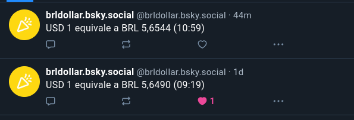

# BlueSkyExchangeRate

BlueSkyExchangeRate é uma aplicação de console em .NET que faz chamadas períodicas a uma API de conversão de moedas, obtem a cotação e cria uma postagem na rede social [BlueSky](https://bsky.app/).

___
## Requisitos
- .NET 6
- Conta na rede social BlueSky
- Token de autenticação da ExchangeRate-API (Versão gratuita suportada)

## Comunicação Externa
### BlueSky
Estamos utilizando a integração via HTTP por meio do AT Protocol XRPC API
Referência: <https://docs.bsky.app/docs/api/at-protocol-xrpc-api>

### Taxa de câmbio
Estamos utilizando a integração com a ExchangeRate-API
Referência: <https://www.exchangerate-api.com/docs/overview>

## Próximos passos
- Renovação do Token de autenticação da API do BlueSky por meio do `refresh_token`
- Dockerizar a aplicação
- Tornar as moedas parametrizáveis por meio dos argumentos no terminal
- Tornar o intervalo de tempo de checagem da cotação parametrizável por meio dos argumentos no terminal 